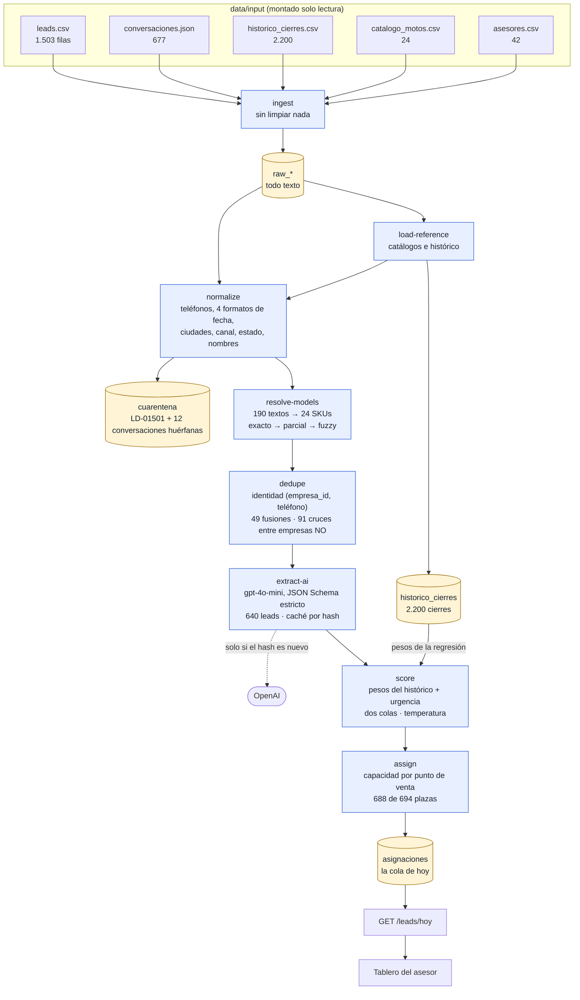
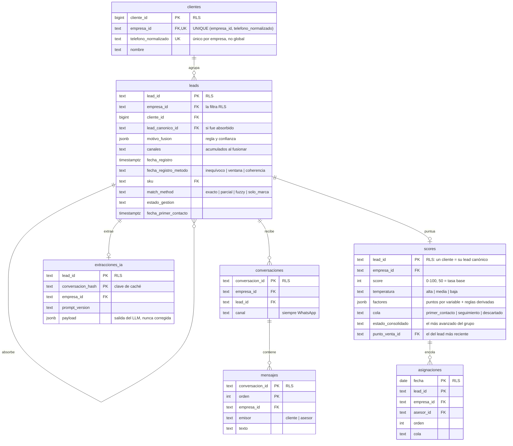
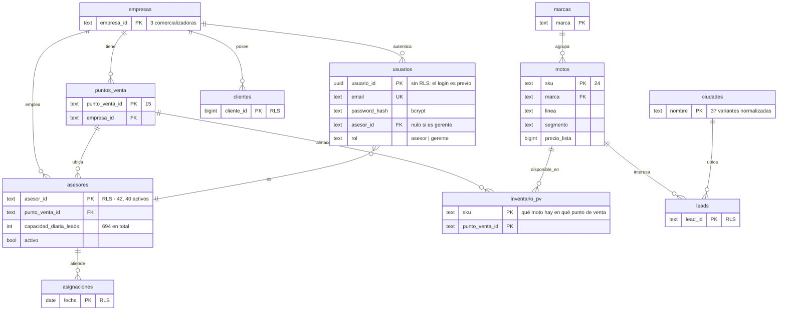
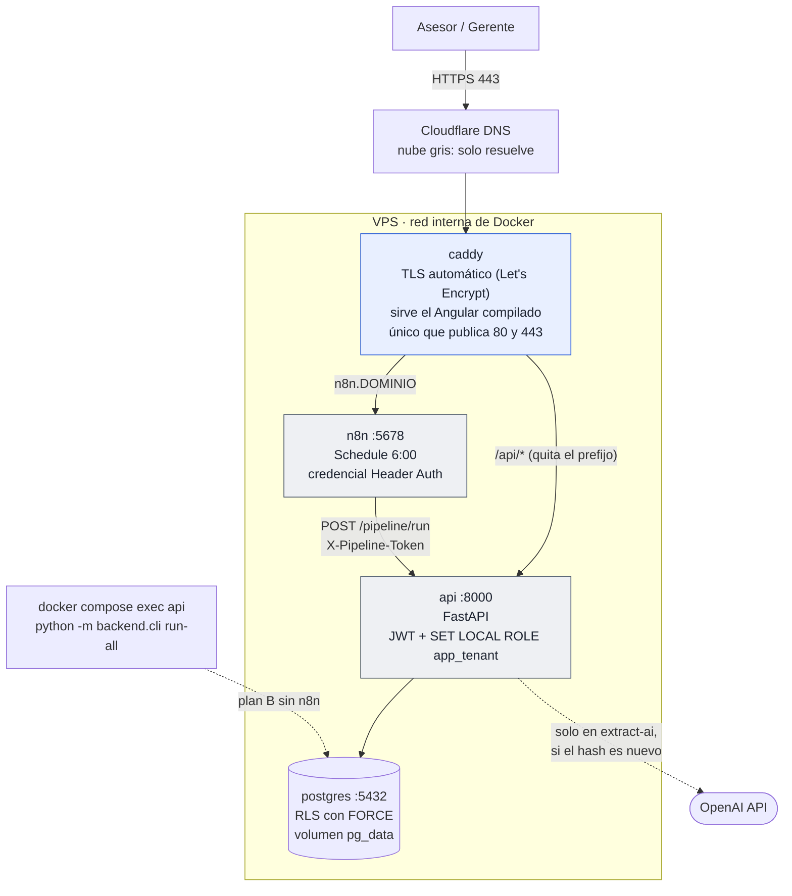

# Arquitectura

Tres vistas del mismo sistema: **qué le pasa a un lead** (flujo de datos), **cómo están guardados** (modelo entidad-relación) y **dónde corre todo** (despliegue). Los diagramas son Mermaid, así que se versionan como texto y GitHub los dibuja solo.

**Los mismos diagramas en SVG**, para verlos con zoom o llevarlos a una presentación: [flujo de datos](diagramas/flujo-datos.svg) · [MER: el camino de un lead](diagramas/mer-camino-del-lead.svg) · [MER: referencia](diagramas/mer-referencia.svg) · [despliegue](diagramas/despliegue.svg). Se abren en el navegador y escalan sin perder nitidez. Para regenerarlos después de cambiar un diagrama, pega el bloque en [mermaid.live](https://mermaid.live) y exporta a SVG, o guárdalo en un `.mmd` y corre `docker run --rm -u "$(id -u):$(id -g)" -v "$PWD:/data" minlag/mermaid-cli:11.4.2 -i diagrama.mmd -o diagrama.svg -b white` (así se generó `mer-camino-del-lead.svg`). Mermaid exporta con fondo transparente, y las líneas oscuras desaparecen en visores con fondo oscuro: cada SVG lleva como primer elemento un `<rect id="fondo-blanco">` del tamaño del `viewBox`, que hay que volver a agregar tras exportar.

## 1. Flujo de datos

De los cinco archivos de entrada a la lista del día de un asesor. Cada etapa es un subcomando del CLI, corre sola y es idempotente.

**Lo que el diagrama deja ver:**

- `load-reference` es una etapa propia porque `leads` tiene llaves foráneas a `puntos_venta`, `motos` y `ciudades`: la dependencia es dura, no un orden de conveniencia.
- La llamada a OpenAI es la **única** salida a internet del pipeline, y solo ocurre cuando el hash de la conversación es nuevo.
- `historico_cierres` no se cruza con los leads del día: solo alimenta los pesos del score.
- Nada se borra: lo inválido va a `cuarentena` con un motivo específico.

## 2. Modelo entidad-relación

24 tablas. En un solo diagrama quedan ilegibles, así que van en dos: **el camino de un lead** y **los catálogos que lo sostienen**. Solo se muestran las columnas que explican una decisión, más `empresa_id` en todas las tablas que la llevan, porque es la columna del aislamiento; el esquema completo está en `db/migrations/`.

**La marca `RLS`** señala las ocho tablas con Row Level Security (`clientes`, `leads`, `conversaciones`, `mensajes`, `extracciones_ia`, `scores`, `asignaciones`, `asesores`). Todas llevan `empresa_id`, y en ellas una consulta de la API solo ve las filas de la empresa del token.

### 2.1 El camino de un lead

- **`clientes` tiene `UNIQUE (empresa_id, telefono_normalizado)`**, no `UNIQUE (telefono)`. El mismo número en dos comercializadoras son dos personas distintas para el sistema: el aislamiento vive en la restricción, no en el código.
- **`leads` apunta a sí misma.** Al fusionar, el lead absorbido no se borra: queda con `lead_canonico_id` y el `motivo_fusion` que justifica la decisión.
- **`scores` guarda una fila por cliente**, la del lead canónico, con el estado consolidado de todo el grupo. Si leyera solo el canónico, un cliente ya cotizado por un canal aparecería como `sin_gestion` por el otro.

### 2.2 Catálogos, asesores y acceso

- **`usuarios` es la única tabla con `empresa_id` sin RLS.** El login ocurre antes de que exista `app.empresa_id`; con la política activa, la búsqueda por email devolvería cero filas y nadie podría entrar. Su aislamiento se hace en el endpoint.
- **`inventario_pv` tampoco lleva RLS**: es referencia compartida, y ponérsela rompería el join de disponibilidad.
- **`asesores.capacidad_diaria_leads`** es lo que hace que la asignación tenga un techo real por punto de venta, en vez de repartir a ojo.

### 2.3 Las demás tablas

No entran a los diagramas porque no tienen relaciones que explicar:

| Tabla | Para qué |
|---|---|
| `raw_leads`, `raw_conversaciones`, `raw_catalogo`, `raw_asesores`, `raw_historico` | Copia literal de cada archivo, todo texto, sin validar. Apuntan a `ingest_lotes` |
| `ingest_lotes` | Un registro por archivo cargado, con `source_hash` y número de filas |
| `cuarentena` | Filas descartadas con motivo específico, clave `(etapa, origen, clave, motivo)` |
| `historico_cierres` | Los 2.200 cierres pasados. Analítica: solo alimenta los pesos del score, nunca se cruza con los leads del día |
| `schema_migrations` | Qué migraciones se aplicaron |

## 3. Despliegue

Una sola máquina, un `docker-compose.yml` idéntico en local y en producción: solo cambia el `.env`.

**Lo que el diagrama deja ver:**

- **Solo `caddy` publica puertos.** Postgres y n8n no son alcanzables desde internet; se hablan por nombre de servicio en la red interna de Docker.
- **n8n llama a `http://api:8000`**, no a la URL pública: el disparo diario no sale a internet ni depende del DNS.
- **La nube de Cloudflare está gris a propósito.** Con el proxy activo, el challenge de Let's Encrypt no llega a Caddy y el certificado no se emite.
- **El CLI es el plan B:** todo lo que hace n8n se puede hacer por SSH con un comando, que es el seguro contra "la URL no funciona el día de la sustentación".
- **El pipeline corre como superusuario y la API no.** El CLI escribe leads de las tres empresas a la vez; la API baja a `app_tenant` en cada request para que RLS la filtre.
